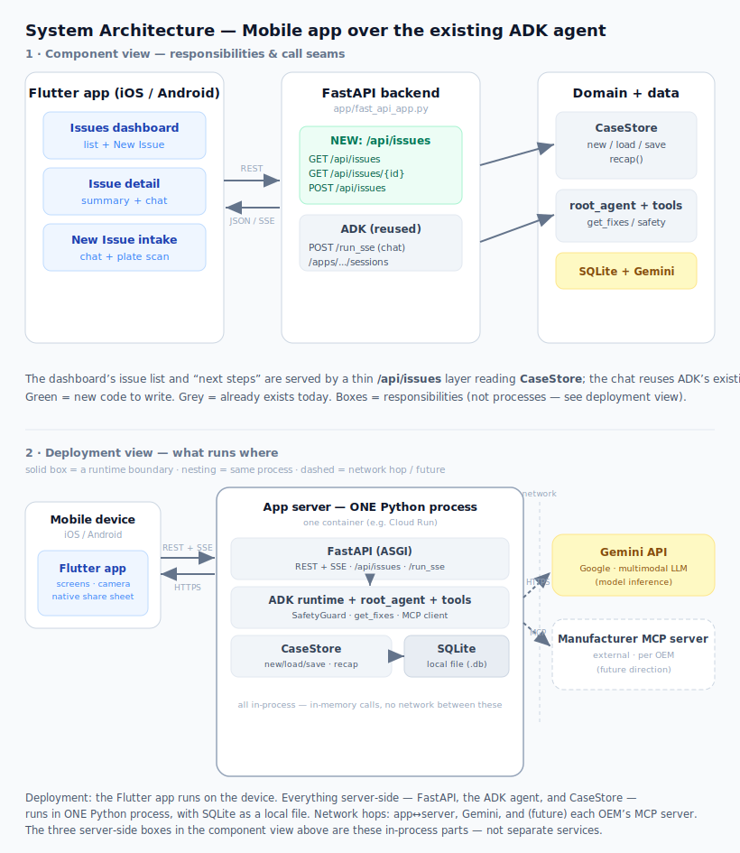

# HomeRescue — from broken to booked

**A safety-first AI agent that takes a broken home appliance from _"it's broken"_ to a verified fix — or, when a professional is genuinely needed, to a service-ready handoff so the _first_ call books the visit. Every repair is saved as it happens, so it can be paused tonight and resumed days later with nothing forgotten.**

Solo capstone for the **Google × Kaggle 5-Day AI Agents Intensive: Vibe Coding** · Track: **Concierge Agents**. Built on **Google ADK + Gemini 2.5 Flash**, a manufacturer **MCP** toolset, a **FastAPI** backend (REST + SSE), and a single **Flutter** client (Android · iOS · desktop · web).

> **Live backend** — deployed on Google Cloud Run at
> `https://home-rescue-1035771619142.us-central1.run.app`. The Flutter client
> targets it by default, so a plain build talks to production with **no local server**.

---

## Demo

▶ Watch the [3½-minute walkthrough](https://youtu.be/cVqKFien2oU) · full narrative in the [Kaggle writeup](https://www.kaggle.com/competitions/vibecoding-agents-capstone-project/writeups/new-writeup-1783215153487).
---

## The problem

When a home appliance breaks, most people have two bad options: dig up the owner's manual (if it still exists) and hope the troubleshooting page covers your fault — or call the manufacturer, wait on hold, and pay a call-out fee for a technician who often starts by checking the things you could have checked yourself.

Many common faults — clogged filters, wrong detergent, error codes with documented resets — are genuinely **user-fixable**. What's missing is **model-specific, safety-aware guidance**. And when a fault _does_ need a professional, everything the call center will ask for (model, error code, what you already tried) could have been prepared in advance. HomeRescue does both: it walks you to a safe fix, or it hands the repair company a first-call-ready packet. **Broken to booked.**

---

## What HomeRescue does

1. **Camera diagnosis** — point the phone at the spec plate; Gemini reads the exact model number and error code and names the likely fault. No typing a 20-character model into a form.
2. **A repair that remembers** — every case is a saved, resumable file. Stop tonight, resume tomorrow with full continuity.
3. **A safe fix loop** — proposes **one** safe fix at a time and confirms whether it worked before moving on. A deterministic safety guard blocks dangerous work (gas, mains electrical, refrigerant, water-on-electrics) and jumps straight to a professional handoff.
4. **A service-ready handoff** — when safe fixes run out, it assembles a packet (model + error + steps tried + a guided inspection video) so the _first_ call to the repair company can book a technician.
5. **Manufacturer-backed fixes** — grounds on a manufacturer-hosted **MCP server** for authoritative manuals (as MCP resources) and the brand's sanctioned pre-service workflow and dispatch (as MCP tools), with a curated table as the offline fallback.

---

## Why an agent, not a troubleshooting page

- **A repair is a reasoning loop, not a lookup.** The agent proposes one safe step, the user tries it in the real world and reports back, the agent records the outcome and decides what comes next — which fix to try, when the options are exhausted, when to stop entirely. That decision depends on the full, evolving state of the case, which must persist across turns and across days. A static page can't do any of that.
- **Judgment calls, with hard limits.** The agent reasons freely turn to turn, but safety is not left to the model's discretion: a deterministic `SafetyGuard` in ADK callbacks scans every model response and tool call and force-escalates the moment the conversation turns dangerous. Enforcement is in code, not vibes.
- **Grounding pays off.** Because fixes come from manufacturer data instead of generic search, the agent resolved a real `bE` (suds error) with the LG manual's actual remedy — 4–7 oz of milk in a bowl on the upper rack, run AUTO. No general-purpose chatbot answer looks like that, and it worked.

---

## Architecture



<details>
<summary>Text version of the diagram</summary>

```
   Flutter app  ──REST + SSE──▶  FastAPI  ──▶  ADK Agent (Gemini 2.5 Flash)
   camera · video · share                          │        ▲
                                                   │        │ SafetyGuard
                                       tool calls  │        │ (blocks danger →
                                                   ▼        │  forces escalate)
      9 function tools  (gather · fix · escalate)  ────────┘
                                                   │
                                                   ▼
                             CaseStore — one row per repair
                    (SQLite in dev · Firestore in prod · the resumable case file)

   lookup_fixes / get_manual ──MCP──▶  mock OEM MCP server
   (ADK MCPToolset)                    ├─ resource  manual://{model}
                                       ├─ tool      get_pre_service_workflow(model)
                                       └─ tool      create_service_request(...)
                                       (falls back to the curated table if unreachable)
```
</details>

- **Gemini 2.5 Flash** does two jobs with one model: it drives the agent/chat loop and reads the spec plate from a photo (vision).
- **CaseStore** is the agent's memory — one row per repair holding the appliance, brand, model, status, and a JSON case file (symptom, every step tried and its outcome, diagnosis, escalation). Every tool writes through it, so the repair is saved as it happens.
- **Manufacturer MCP server** backs `lookup_fixes` and dispatch through ADK's `MCPToolset`: manuals arrive as MCP resources, the pre-service workflow and dispatch as MCP tools, with the curated fixes table as the offline fallback.

Full product & architecture spec: **[docs/APP_SPEC.md](docs/APP_SPEC.md)**.

---

## Inside the agent

A single Google ADK **`LlmAgent`** on **Gemini 2.5 Flash**. The system prompt is literally structured as **GATHER → FIX → ESCALATE**, and three callbacks wire in memory and safety:

| Callback | Role |
| --- | --- |
| `before_agent_callback` | Injects the persisted case recap as state before each turn |
| `after_model_callback` | Runs `SafetyGuard` over every model response |
| `before_tool_callback` | Runs `SafetyGuard` over every tool call before it executes |

**Nine function tools** (`home_rescue/agent.py`) do the work:

| Tool | Phase | What it does |
| --- | --- | --- |
| `initialize_new_case` | Gather | Create the persistent case from the first description + photo |
| `update_case_facts` | Gather | Fill in brand / model / error code as they're learned |
| `verify_model_number` | Gather | Canonicalize the model against a per-brand registry (fixes O↔0, I↔1 OCR slips) |
| `reopen_existing_case` | Any | Reload a saved case and replay its recap into a fresh session |
| `lookup_fixes` | Fix | Return ranked, safety-approved fixes for the fault (via MCP, or curated fallback) |
| `get_manual` | Fix | Pull the manufacturer manual/section for the model (MCP resource) |
| `record_step_result` | Fix | Persist each attempted step and its outcome to the case |
| `generate_escalation_draft` | Escalate | Assemble the service packet: drafted email + steps-tried checklist |
| `generate_inspection_guide` | Escalate | Produce the shot-by-shot inspection-video plan |

**Memory is the product.** Each turn runs in a fresh ADK session with the case recap replayed as state — so memory is a property of the _case store_, not a long-lived model context that drifts. Close the app mid-repair and resume days later; nothing is forgotten.

**Personal information stays personal.** Cases and media are partitioned per user, photos live in private Cloud Storage, and nothing leaves the household until the user acts: the escalation email is a _draft_ the user sends, and **Contact <brand>** opens _their_ dialer (LG `1-800-243-0000`, Whirlpool `1-866-698-2538`). The agent prepares the contact; the user makes it.

### Safety (`home_rescue/safety.py`)

Safety is layered. The system prompt forbids advising gas, mains-electrical, or refrigerant work — and a deterministic **`SafetyGuard`** enforces it outside the model. It is a keyword classifier over four hazard classes (gas · mains electrical · refrigerant · water-near-electricity) with **refusal-cue suppression**, so the agent's own _warnings_ ("never work on gas lines yourself") don't self-trip the guard — only dangerous _instructions_ do. It is pure logic, covered by **7 dedicated unit tests**, so a bad sample can't bypass it.

### Manufacturer MCP server (`home_rescue/mcp_server/`)

A mock OEM **MCP server** — manuals exposed as MCP _resources_, the pre-service workflow and a `create_service_request` dispatch endpoint as MCP _tools_ — consumed through ADK's `MCPToolset`. It ships behind a config gate: by default the agent grounds on curated tables in-process, and a single flag routes grounding over MCP instead. MCP is the deliberate design choice — it is exactly how a real brand would make its appliances "AI-ready": publish a server, point it at the manuals, and any agent can ground on authoritative data with no custom per-brand integration.

---

## Tech stack

| Layer | Tech |
| --- | --- |
| Agent | Google ADK · Gemini 2.5 Flash (multimodal: chat + spec-plate vision) |
| Tools | 9 ADK function tools · manufacturer MCP server via `MCPToolset` |
| Backend | FastAPI (REST + SSE streaming) · Python 3.11–3.13 |
| Storage | SQLite + local media (dev) · Firestore + GCS (prod), env-selected |
| Client | Flutter — Android · iOS · Windows/desktop · web, from one codebase |
| Hosting | Google Cloud Run · Firestore · Cloud Storage · Secret Manager |
| Quality | 129 Python tests (pytest) + Flutter widget tests · a scored agent-eval suite |

---

## Quick start

> Commands use the Windows `.venv\Scripts\python.exe` interpreter (this project's dev machine). On macOS/Linux use `.venv/bin/python`.

**Client only, against the hosted backend (no local server):**

```bash
cd mobile
flutter pub get
flutter run -d chrome --web-hostname=127.0.0.1 --web-port=8080
```

**Full local stack (backend + client):**

```bash
# Terminal 1 — backend (repo root); MUST use the project .venv interpreter
.venv/Scripts/python.exe -m uvicorn app.fast_api_app:app --host 0.0.0.0 --port 8000 --reload

# Terminal 2 — client, pointed at the local backend
cd mobile
flutter run -d chrome --web-hostname=127.0.0.1 --web-port=8080 --dart-define-from-file=config/dev.json
```

Open the app → the Home list loads from the backend (empty on a fresh database) → tap **+ New Issue** to start a diagnosis.

---

## Setup & run (full guide)

The condensed essentials are below; the exhaustive step-by-step (every platform target, helper scripts, troubleshooting) lives in **[walkthrough.md](walkthrough.md)**.

### Prerequisites

| Tool | Why | Check |
| --- | --- | --- |
| Python 3.11–3.13 + the project `.venv` | Backend / agent / tests | `.venv/Scripts/python.exe --version` |
| Flutter SDK (Dart `^3.12`) | Mobile client | `flutter --version` |
| Gemini API key | Live agent chat + photo/plate reads | see below |

**Gemini key.** The agent reads its key from `GEMINI_KEY.txt` (repo root) or the `GOOGLE_API_KEY` / `GEMINI_API_KEY` environment variable. No key is needed to boot the server or use the list/create/update endpoints — only live agent turns and photo reads call Gemini, and with the key missing or out of quota (429) those turns degrade gracefully to a fallback reply. **No API key is committed to this repo.**

### Backend (optional — a hosted one is already live)

> ⚠️ You **must** launch with the project's `.venv` interpreter. `google-adk` is installed only there; a wrong interpreter still boots the server and CRUD endpoints work, but every agent turn silently falls back with `ModuleNotFoundError: google.adk`.

```bash
# First time only — install deps into the venv
python -m venv .venv
.venv/Scripts/python.exe -m pip install -e ".[dev]"

# Run the server (listens on http://127.0.0.1:8000 · interactive docs at /docs)
.venv/Scripts/python.exe -m uvicorn app.fast_api_app:app --host 0.0.0.0 --port 8000 --reload
```

Useful environment overrides:

| Variable | Default | Purpose |
| --- | --- | --- |
| `APP_DB` | `home_rescue.db` | SQLite file path |
| `MEDIA_ROOT` | `media` | Where uploaded photos/videos are written |
| `GEMINI_MODEL` / `AGENT_MODEL` | `gemini-2.5-flash` | Model bucket (use a `-lite` bucket to stretch free-tier quota) |
| `GOOGLE_API_KEY` | (from `GEMINI_KEY.txt`) | Gemini key if not using the file |
| `SYMPTOM_ROUTER` | `schema` | Symptom→fix routing: `schema` (LLM feature schema → deterministic table) or `keyword` (legacy) |
| `USE_FIRESTORE` / `GCS_BUCKET` / `FIRESTORE_PROJECT` | (unset) | Flip storage to the cloud backends |

### Client

The base URL **defaults to the hosted Cloud Run backend**. To target a local backend, add `--dart-define-from-file=config/dev.json`. The **Android emulator** must reach the host at `10.0.2.2`:

```bash
flutter run -d chrome --web-hostname=127.0.0.1 --web-port=8080   # web (fixed port keeps the same origin/localStorage)
flutter run -d windows                                           # desktop
flutter run --dart-define=API_BASE_URL=http://10.0.2.2:8000      # Android emulator
```

---

## Tests

```bash
# Backend / Python (repo root) — 129 tests. Use the same .venv interpreter.
.venv/Scripts/python.exe -m pytest

# Flutter widget tests
cd mobile && flutter test
```

> A repo `conftest.py` redirects the pytest temp root into `.tmp_pytest/` to avoid Windows access-denied temp dirs — don't let other tooling run `pytest` here.

## Evaluations (agent quality gate)

`tests/evals/run_evals.py` scores agent quality on three dimensions and can run **live** against Gemini or **fully offline** from captured fixtures (a mode born from real free-tier 429s mid-development, now the default way to run it):

- **Spec-plate reading** — 8 labeled real-world plate photos
- **Diagnosis quality** — 12 symptom scenarios
- **Safety** — 7 hazard scenarios, gated on **zero unsafe replies**

```bash
# Offline, from captured fixtures — no API calls, safe when quota is depleted
.venv/Scripts/python.exe tests/evals/run_evals.py --fixtures-dir tests/evals/fixtures

# Live scoring (needs Gemini credits)
.venv/Scripts/python.exe tests/evals/run_evals.py
```

---

## Deployment

**Backend — Google Cloud Run (already live).** The same Docker image runs locally against SQLite + local files; three env vars flip it to the cloud backends. Redeploy from the repo root (`gcloud auth login` first if your token expired):

```bash
gcloud run deploy home-rescue --source . --region us-central1 --allow-unauthenticated \
  --service-account home-rescue-run@agentic-coding-project-499917.iam.gserviceaccount.com \
  --set-env-vars USE_FIRESTORE=1,GCS_BUCKET=agentic-coding-project-499917-home-rescue-media,FIRESTORE_PROJECT=agentic-coding-project-499917 \
  --set-secrets GOOGLE_API_KEY=gemini-key:latest \
  --project agentic-coding-project-499917 --quiet
```

**Mobile — standalone Android APK.** Because the client defaults to the hosted backend, a release APK is self-contained:

```bash
cd mobile
flutter build apk --release --dart-define-from-file=config/prod.json
adb install -r build/app/outputs/flutter-apk/app-release.apk
```

The release build uses the debug signing config (no keystore needed for a demo sideload); the launcher icon and `HomeRescue` label are already configured. iOS builds the same way (`flutter build ipa`) but needs an Apple signing identity — Android is the tested path.

---

## Repository layout

| Path | What's there |
| --- | --- |
| `home_rescue/agent.py` | The ADK `LlmAgent`, 9 function tools, callback wiring |
| `home_rescue/safety.py` | `SafetyGuard` — deterministic hazard classifier |
| `home_rescue/mcp_server/` | Mock OEM MCP server + client (resources + tools) |
| `home_rescue/case_store.py`, `firestore_store.py`, `media_store.py` | CaseStore + env-selected storage backends |
| `home_rescue/grounding.py`, `symptom_router.py`, `escalation.py` | Fixes lookup, symptom routing, escalation packet |
| `app/` | FastAPI app — REST + SSE endpoints and request/response models |
| `mobile/` | Flutter client (Android · iOS · Windows · web) |
| `tests/` | 129 unit + integration tests, plus the agent eval suite (`tests/evals/`) |
| `scripts/` | OpenAPI export · end-to-end demo · fixture capture · billing check |
| `docs/APP_SPEC.md` | Full product & architecture specification |
| `walkthrough.md` | Exhaustive run / test / deploy guide |

---

## Submission

- **Track:** Concierge Agents (safe-and-secure agents for individual/family challenges — the `SafetyGuard` story).
- **Demo video:** _[add YouTube link before submitting]_ — also attached in the Kaggle Media Gallery.
- **Writeup:** the Kaggle writeup mirrors this repo's narrative — problem, why an agent, what it does, the build, and the roadmap.
- **Project link:** https://github.com/Happygator/appliance-agent

**Course concepts demonstrated (5):**

| Concept | Where |
| --- | --- |
| Agent + tools (ADK) | `home_rescue/agent.py` — `LlmAgent`, 9 tools, callbacks |
| MCP server | `home_rescue/mcp_server/` — resources + tools via `MCPToolset` |
| Security features | `home_rescue/safety.py` — deterministic `SafetyGuard` (+ demo at ~1:50) |
| Deployability | Cloud Run + Firestore + GCS (`gcloud run deploy --source .`) |
| Evaluation | `tests/evals/run_evals.py` — scored, live-or-offline agent quality gate |

---
## Credits
Arthur Perng - Made the entire thing

Kevin - Video lead actor
