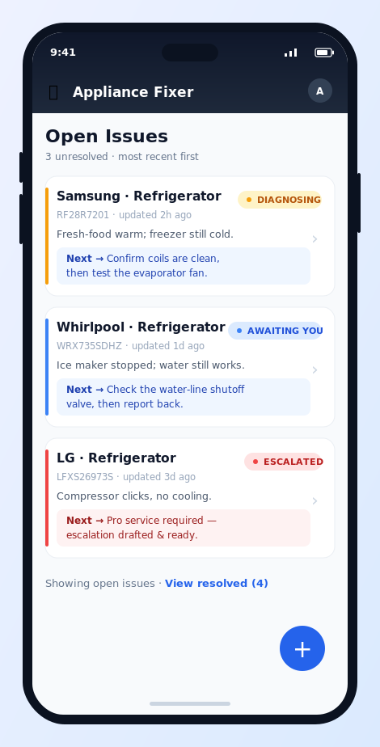
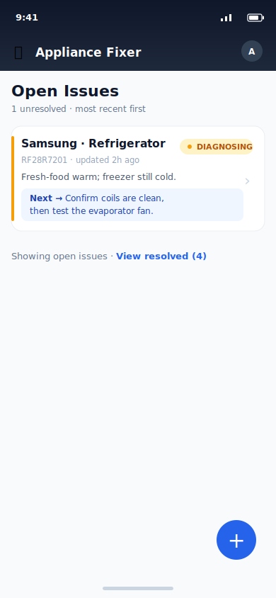
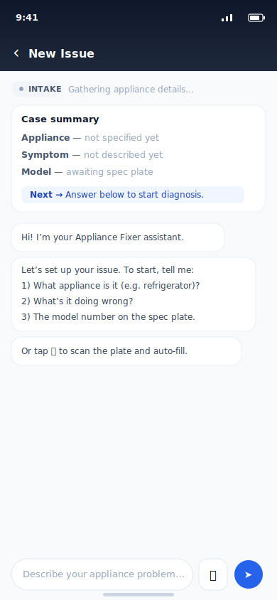
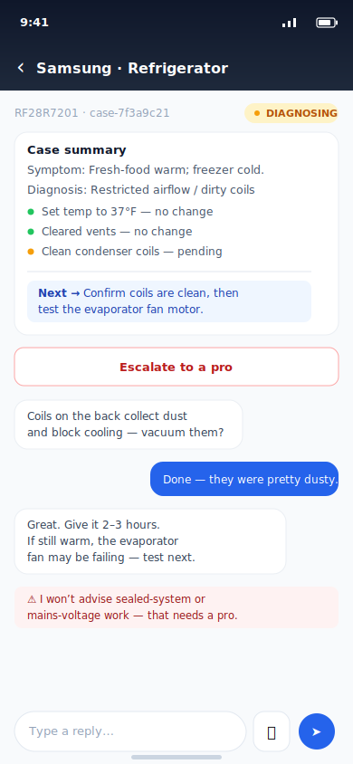
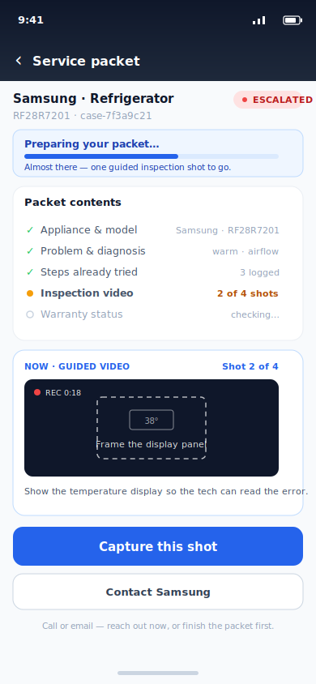

# Frontend Design: HomeRescue — Mobile App (iOS + Android)

Status: PROPOSED · 2026-06-21 (revised 2026-06-24 — mobile-first)
Owner: (you) · Backend: existing Google ADK agent (`home_rescue.root_agent`)
Related: [APP_SPEC.md](./APP_SPEC.md), [DESIGN.md](./DESIGN.md), [IMPLEMENTATION_PLAN.md](./IMPLEMENTATION_PLAN.md)



## 1. Purpose

The agent today is reachable only through ADK's generic developer playground (`adk web`) — a single
ephemeral chat with no concept of "my open problems." This document designs the purpose-built
**mobile app** ([APP_SPEC.md](./APP_SPEC.md) stack: Flutter, iOS + Android) that the user actually
holds while standing in front of a broken appliance. Two headline requirements:

1. A prominent **New Issue** action — a floating **+** button — that starts a new appliance-problem
   case. Describe-first: the user types what's wrong and can attach one optional photo right there at
   the appliance.
2. An **at-a-glance list of all unresolved issues**, each showing a brief **"next steps"** summary so
   the user knows what to do without reopening the chat.

An "issue" is exactly the agent's existing **case** — this app is a view over the `CaseStore` that
already exists; it does not invent a new data model.

> **Terminology:** the screens say *Issue*; the data layer and code say *case* (`CaseStore`,
> `case_id`). [APP_SPEC.md](./APP_SPEC.md) currently calls the same thing a *Repair*. These should be
> unified across the docs — see the note in §11.

## 2. How this maps to what already exists

| App concept | Backend reality (today) |
|-------------|-------------------------|
| Issue | A row in the `cases` table ([case_store.py](../home_rescue/case_store.py)) |
| Issue ID | `case_id` (e.g. `case-7f3a9c21`) |
| Unresolved | `status` ∈ `intake, diagnosing, awaiting_user, escalated` (everything except `resolved`) |
| Title | `brand` + `model_number` + `appliance` |
| Symptom | `data.symptom_text` |
| Steps taken | `data.steps[]` with per-step `outcome` |
| Next steps | Derived — see §6 |
| The chat | ADK conversation via `/run_sse`, reopened with `reopen_existing_case(case_id)` |

**The one real gap:** the running server ([fast_api_app.py](../app/fast_api_app.py)) exposes ADK's
chat/session routes but **no endpoint to _list_ cases**. The app cannot be built without a thin REST
layer over `CaseStore` (§5). This is the bulk of the new backend work; the chat itself is reused
as-is, and the mobile client talks to the same FastAPI server over REST + SSE.

## 3. Home — the issues dashboard

The landing screen. Unresolved issues are the entire focus; **New Issue** is the only primary action.



**Anatomy**
- **App bar** — product name + account avatar, under the device status bar.
- **New Issue** — a floating action button (**+**) bottom-right; opens the intake flow in §4. A FAB
  keeps the primary action reachable by thumb and out of the way of the list.
- **Issue cards**, newest-updated first. Each card shows:
  - Appliance title (`brand · appliance`) and a **status badge** (color-coded, with a status dot).
  - A muted meta line: `model_number ·` relative "updated" time (from `updated_at`).
  - **Symptom** line (`data.symptom_text`, truncated to fit one line on a phone).
  - A highlighted **`Next →`** strip: the one-line "what to do next" summary (§6), wrapping to two
    lines as needed.
  - The whole card is tappable (a chevron hints at it) → issue detail (§7).
- **Resolved issues are hidden** behind a "View resolved (n)" link so the open list stays the focus.

**Status → color**

| Status | Badge | Meaning |
|--------|-------|---------|
| `intake` | grey | Created, still gathering brand/model/symptom |
| `diagnosing` | amber | Actively working a fix |
| `awaiting_user` | blue | Waiting on the user to try something / report back |
| `escalated` | red | Handed to a pro; escalation email drafted |
| `resolved` | green | Closed (hidden from the open list) |

## 4. New Issue flow

The **+** opens a **full-screen composer** ([new_issue_screen.dart](../mobile/lib/screens/new_issue_screen.dart)),
not a scripted chat. It's titled **"What's going on with your appliance?"** and asks for the smallest
thing that lets the agent start: a free-text description, plus **one optional photo**. No appliance
picker, no brand/model fields, no scripted Q&A — the agent gathers the rest conversationally once the
chat opens.



**Captured on the composer**
- **Description** — a multiline field ("Describe what it's doing wrong…"). This becomes the case's
  `symptom_text` **and** the first user message in the chat transcript.
- **Optional photo** — **Add a photo** (camera) or **Choose from photos** (library). One attachment,
  shown as a thumbnail with a **Remove** affordance. No presumption about what it is — it may be the
  spec plate, the symptom, or both; the agent decides in context (next bullet).

**On "Start diagnosis"** (button disabled until the description is non-empty):
1. `POST /api/issues` with the typed `symptom` → `initialize_new_case(...)` returns a `case_id`
   (`status = diagnosing`).
2. If a photo was attached, `POST /api/issues/{case_id}/media` (with inline retry) → a `media_ref`.
3. `POST /api/issues/{case_id}` seeds the description as the **first user message** in the transcript,
   with the photo attached via `media_ref` (rendered inline in the chat bubble).
4. Navigate to the issue detail / chat (§7), where the agent **auto-kicks off**
   (`POST /api/issues/{case_id}/start`). The attached image is passed to Gemini on this kickoff turn,
   so it evaluates the photo in context — no presumption of plate vs. symptom.

The new issue then appears on the dashboard automatically.

> Spec-plate reading hasn't gone away — it's just no longer a gating intake step. `read_spec_plate`
> (the `POST /api/issues/{case_id}/plate` route, §5) is still available **within the chat**, and the
> agent can read a model number straight off the kickoff photo when one is present.

**Edge cases**
- **Empty description** → **Start diagnosis** stays disabled; nothing is created.
- **No photo** → fine; the agent asks for whatever it still needs (including a plate photo) in chat.
- **Photo upload hiccup** → an inline retry (`uploadMediaWithRetry`); a hard failure surfaces a
  non-blocking "Could not start your issue. Please try again." message and leaves the composer intact.
- **Dangerous symptom** (gas/refrigerant/mains) → the issue is still created, but the agent's
  `before_model_callback` safety guard steers the kickoff turn toward escalation.

## 5. Backend: the new `/api/issues` layer

A thin FastAPI router added to [fast_api_app.py](../app/fast_api_app.py), wrapping the existing
`CaseStore`. No new persistence — same SQLite DB the agent already writes.

```
GET  /api/issues?status=open        -> [ IssueSummary ]   # dashboard list
GET  /api/issues/{case_id}          -> IssueDetail        # detail screen
POST /api/issues                    -> { case_id }        # New Issue -> initialize_new_case
POST /api/issues/{case_id}/plate    -> { brand, model, error_code }   # read_spec_plate
```

`IssueSummary` (one card):
```jsonc
{
  "case_id": "case-7f3a9c21",
  "title": "Samsung · Refrigerator",
  "model_number": "RF28R7201",
  "status": "diagnosing",
  "symptom": "Fresh-food compartment warm; freezer cold.",
  "next_step": "Confirm condenser coils are clean, then test the evaporator fan.",
  "updated_at": "2026-06-21T18:04:00Z"
}
```

The chat itself is **not** re-implemented — the detail screen talks to ADK's existing `/run_sse`,
opening the case with `reopen_existing_case(case_id)` so the agent loads the full recap and prior
steps. Two stores stay separate, exactly as the agent already intends: `CaseStore` = the structured
issue, ADK session = the live conversation.

## 6. Computing "next steps" (the headline detail)

The dashboard's value is the one-line next-step per issue. Three derivation tiers, cheapest first —
**no extra LLM call on dashboard load**:

1. **Escalated** → `"Pro service required — escalation email drafted and ready to send."`
   (from `data.escalation`).
2. **Has a pending/last step** → surface the most recent not-yet-resolved step's instruction (from
   `data.steps[]`), e.g. *"You were asked to check the water-line shutoff — report back."*
3. **Diagnosing with a hypothesis** → first un-tried fix from `get_fixes(...)` against the stored
   `diagnosis`, e.g. *"Confirm coils are clean, then test the evaporator fan."*

Persist this as a `next_step` string on the case (write it whenever `record_step_result` or
`lookup_fixes` runs) so the list is a pure DB read and stays snappy — consistent with the project's
existing caching decision (cache expensive reads in the case `data`).

## 7. Issue detail

Opened by tapping a card. On a phone this is a **single scrolling screen**, not a desktop two-pane: a
compact **case summary** card on top, then the live agent chat below it, with a fixed input bar
(text + camera) pinned to the bottom. This keeps the agent's memory glanceable while the conversation
stays the primary surface.



- **Case summary (top card)** — `symptom_text`, `diagnosis` (hypothesis + confidence), `steps[]`
  rendered as a short checklist (green = resolved/done, amber = pending), the derived next step, and
  an **Escalate to a pro** action (→ `generate_escalation_draft`, draft-only).
- **Chat (below)** — the reopened conversation; the input bar carries a camera button for
  symptom/plate photos. The safety guard's refusals render inline as a distinct warning bubble, so
  "this needs a pro" is visible rather than buried.

### Escalation — the service-ready packet

When fixes run out (or a safety stop forces it), **Escalate to a pro** assembles a **service-ready
packet** the user can hand to a repair company on the first call — so the conversation starts at
"here's everything," not "let me describe the problem." It bundles the model, the symptom and working
diagnosis, the **steps already tried** (so the company doesn't re-walk them), and the captured media
(spec-plate photo, symptom photo, guided inspection video). The app **guides the inspection capture
shot-by-shot** while assembling the packet. Prepared, **not auto-sent** — the user shares it via the
native share sheet, or reaches the manufacturer (**Contact Samsung**) by call or email.



## 8. Architecture


Green = new code (the `/api/issues` router). Grey = reused as-is (`CaseStore`, `root_agent`, tools,
ADK `/run_sse`, SQLite, Gemini). The Flutter app is a thin client over machinery that already exists
and is already tested; all diagnosis logic, state, and persistence stay on the server (the agent is
ADK/Python, so it cannot run on-device — see
[DESIGN_BRAINSTORM.md §6](./DESIGN_BRAINSTORM.md#6-clientserver-split--thin-client-thick-server-recorded-2026-06-24)).

## 9. Suggested tech & build order

- **Stack:** **Flutter (Dart)** for iOS + Android, per [APP_SPEC.md](./APP_SPEC.md). It talks to the
  existing FastAPI app over **REST + SSE** (SSE for the streaming `/run_sse` chat). One backend, two
  platforms from one codebase, reusing ADK's CORS config.
- **Build order**
  1. `GET /api/issues` + `GET /api/issues/{id}` over `CaseStore` (+ tests). Unblocks everything.
  2. Dashboard (list + status badges + next-step strip + FAB).
  3. New Issue composer → `POST /api/issues` (typed symptom) + optional photo upload, then seed the
     description as the first chat message and hand off to detail (the agent auto-kicks off).
  4. Issue detail: summary card, then wire the chat to `/run_sse` via `reopen_existing_case`.
  5. Persist the derived `next_step`; add the resolved-issues view.

## 10. Out of scope (v1)

- Multi-user accounts / auth (the agent uses a single `user-default` today).
- Real outbound email — escalation stays **draft-only**, matching the agent.
- Appliances beyond refrigerator (washer is a gated stretch in the agent itself).
- Editing/deleting issues, search/filter beyond open-vs-resolved, push notifications.

## 11. Open questions

1. **Terminology** — this app says **Issue**, the code says **case**, [APP_SPEC.md](./APP_SPEC.md)
   says **Repair**. Pick one user-facing word and align all three docs + the mockups. (This doc uses
   *Issue* to match the screens.)
2. **`next_step` freshness** — persist-on-write (§6, recommended) vs. compute live per request?
   Persist-on-write is snappier but can lag if the agent changes state outside the tools.
3. **`awaiting_user` status** — the agent currently only sets `diagnosing`/`resolved`
   ([agent.py:185](../home_rescue/agent.py)). To light up the blue "Awaiting you" badge,
   `record_step_result` should set `awaiting_user` when it logs a step whose `outcome` is
   `unsure`/pending. Small agent tweak — in scope or defer?
4. **Auth boundary** — fine to keep single-user for the capstone demo, or stub a user id?
